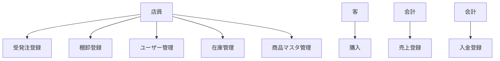
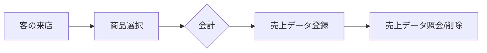
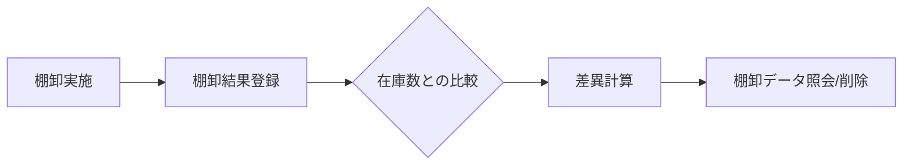
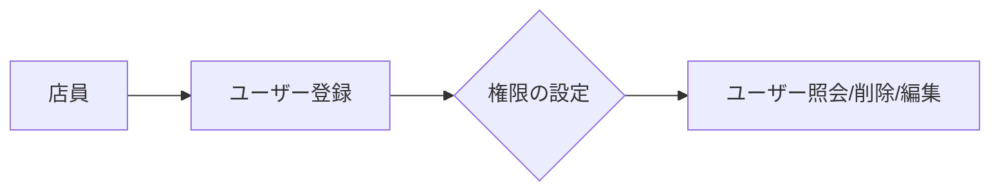
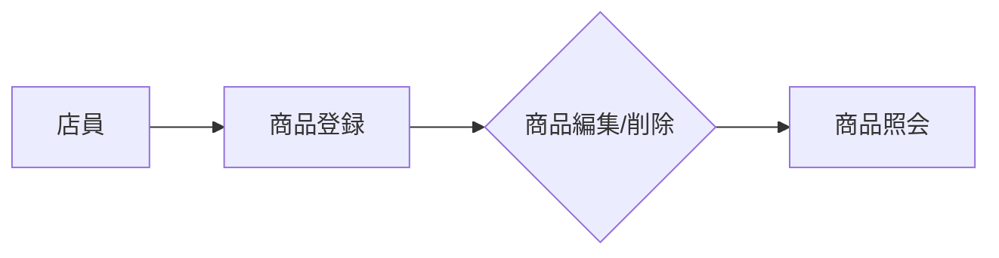
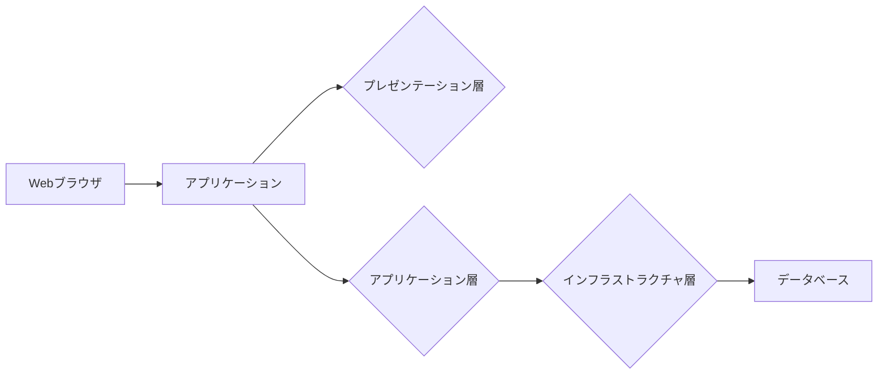
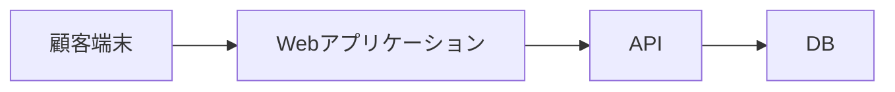
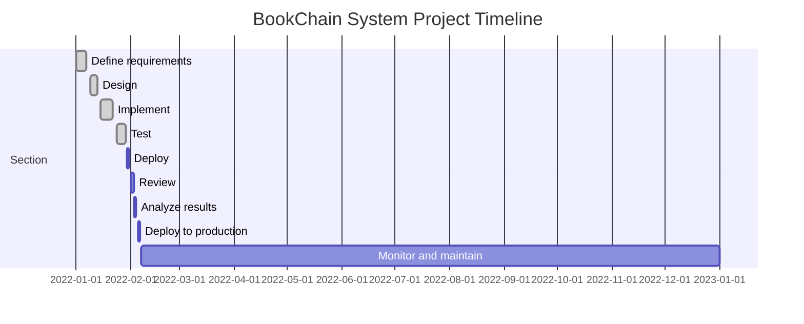

# 書店チェーンシステム要件定義

## 機能要件

1. **売上管理**
   - 売上データの登録、照会、削除
   - 売上データの集計（日別、週別、月別、年別）
   - 売上データのエクスポート（CSV, Excel）

2. **受発注管理**
   - 受発注データの登録、照会、削除
   - 在庫数との照合、不足分を自動計算
   - 発注書の作成

3. **棚卸管理**
   - 棚卸データの登録、照会、削除
   - 棚卸結果と在庫数の比較、差異を自動計算
   - 棚卸結果のエクスポート（CSV, Excel）

4. **入金管理**
   - 入金データの登録、照会、削除
   - 入金データと売上データの照合、未収金を自動計算
   - 入金書の作成

5. **ユーザー管理**
   - ユーザーの登録、削除、編集
   - 権限の設定と管理

6. **在庫管理**
   - 在庫数の照会と変更
   - 在庫数の自動計算（受発注管理、棚卸管理から）

7. **商品マスタ管理**
   - 商品マスタの登録、削除、編集

## ユースケース図



## 業務フロー図

### 売上業務フロー



### 受発注業務フロー


### 棚卸業務フロー



### 入金業務フロー


### ユーザー管理業務フロー



### 在庫管理業務フロー


### 商品マスタ管理業務フロー



## システム設計書

- **アーキテクチャ**: 3層アーキテクチャ（プレゼンテーション、アプリケーション、インフラストラクチャ）
- **技術スタック**:
  - フロントエンド: React
  - バックエンド: Node.js (Express)
  - データベース: PostgreSQL

## アーキテクチャ図



## データモデル

### テーブル一覧

| テーブル名 | 主キー | カラム名 |
| --- | --- | --- |
| 売上データ | id | 売上日時, 商品ID, 数量, 金額 |
| 受発注データ | id | 受発注日時, 商品ID, 数量, 状態 |
| 棚卸データ | id | 棚卸日時, 商品ID, 在庫数, 差異 |
| 入金データ | id | 入金日時, 売上データID, 金額, 状態 |
| ユーザー | id | ユーザー名, メールアドレス, パスワードハッシュ, 権限 |
| 商品マスタ | id | 商品名, 価格, 在庫数 |

## ユーザーインターフェース

- Webアプリケーション
- レスポンシブデザイン
- モバイル対応

## エラー処理

- 入力エラー: 入力内容に基づくエラーメッセージを表示
- システムエラー: エラーログを記録、ユーザーに友好的なメッセージを表示

## バックアップ

- データベースの定期バックアップ（毎日）
- バックアップファイルの保存先は別のサーバーまたはネットワークストレージ
- バックアップの自動化と復元手順の文書化

## セキュリティ

- ユーザー認証: ログイン機能、パスワードハッシュ化
- アクセス制御: 権限管理、ロールベースのアクセス制御
- データ暗号化: 暗号化通信（HTTPS）とデータベースレベルでの列レベル暗号化

## パフォーマンス

- キャッシュ機能の実装（Redis）
- データベースインデックスの最適化
- システムモニタリングとパフォーマンステストの実施

## ログ管理

- アプリケーションログの記録（winston）
- ログの集約と分析ツールの導入（ELKスタック）
- ログの定期的なアーカイブと削除

## テストケース

| テストケースID | 概要 | 手順 | 期待値 |
| --- | --- | --- | --- |
| TC001 | 売上データ登録テスト | 1. 売上データを登録する <br> 2. 売上データ照会する | 売上データが正しく表示される |
| TC002 | 受発注データ登録テスト | 1. 受発注データを登録する <br> 2. 受発注データ照会する | 受発注データが正しく表示される |
| TC003 | 棚卸データ登録テスト | 1. 棚卸データを登録する <br> 2. 棚卸データ照会する | 棚卸データが正しく表示される |
| TC004 | 入金データ登録テスト | 1. 入金データを登録する <br> 2. 入金データ照会する | 入金データが正しく表示される |
| TC005 | ユーザー登録テスト | 1. ユーザーを登録する <br> 2. ユーザー照会する | ユーザーが正しく表示される |
| TC006 | 在庫数変更テスト | 1. 在庫数を変更する <br> 2. 在庫数照会する | 在庫数が正しく表示される |
| TC007 | 商品登録テスト | 1. 商品を登録する <br> 2. 商品照会する | 商品が正しく表示される |
| TC008 | エラー処理テスト | 1. 入力エラーを発生させる <br> 2. システムエラーを発生させる | 適切なエラーメッセージが表示される |

## 非機能要件

- **可用性**: システムの99.5%のアップロード時間を確保
- **レスポンス時間**: ユーザー操作から画面反映まで3秒以内に完了
- **拡張性**: 新しい機能やデータの追加に対応可能な柔軟な設計
- **セキュリティ**: ユーザー認証とアクセス制御を実装し、データの暗号化を確保する
- **パフォーマンス**: キャッシュ機能の実装とデータベースインデックスの最適化により高いパフォーマンスを維持する
- **バックアップ**: データベースの定期的なバックアップと復元手順の文書化によりデータの損失を防止する

この要件定義は、書店チェーンシステムの機能要件、ユースケース図、業務フロー図、システム設計書、データモデル、ユーザーインターフェース、エラー処理、バックアップ、セキュリティ、パフォーマンス、ログ管理、テストケース非機能要件を網羅しています。この要件定義に基づき、システム開発が実施されます。


# 書店チェーンシステム基本設計書

## プロジェクト概要
### プロジェクト名
BookChain System

### プロジェクトの目的
ある書店チェーンの売上と入金に関するシステム開発

### 背景と経緯
当社は、全国に展開する書店チェーンを運営しています。これまでの帳票管理が紙ベースで行なわれており、効率化やエラーの防止など問題点が多々ありました。そこで、売上と入金に関するシステムの開発を検討し、業務の効率化と正性の向上を図ることになりました。

## システムの目的
書店チェーン全体で統一された売上と入金管理を行い、帳票作成や集計などの業務を効率化すること。また、データの正確性を確保し、不正アクセスからシステムを守ること。

## 機能一覧
- 売上登録
- 売上集計
- 入金登録
- 入金集計
- 会計処理

## 機能要件
### 売上管理
**機能ID:** FUNC001
**機能名:** 売上登録
- 前提条件: 顧客が商品を購入し、会計処理が完了していること。
- 機能内容: 売上データ（顧客情報、商品情報、金額等）の登録が可能であること。
- 後提条件: 売上データは正しく登録されること。
- 制約事項: 売上データの登録は、会計処理完了後に行うこと。

**機能ID:** FUNC002
**機能名:** 売上集計
- 前提条件: 売上データが正しく登録されていること。
- 機能内容: 売上データを日別、週別、月別に集計することができること。集計結果のグラフ化表示も可能であること。
- 後提条件: 集計結果は正確に表示されること。
- 制約事項: 集計単位は日、週、月で固定とすること。

### 入金管理
**機能ID:** FUNC003
**機能名:** 入金登録
- 前提条件: 顧客から入金があったこと。
- 機能内容: 入金データ（顧客情報、金額等）の登録が可能であること。入金データの検索・表示も可能であること。
- 後提条件: 入金データは正しく登録されること。
- 制約事項: 入金データの登録は、入金があった時点で行うこと。

**機能ID:** FUNC004
**機能名:** 入金集計
- 前提条件: 入金データが正しく登録されていること。
- 機能内容: 入金データを日別、週別に集計することができること。集計結果のグラフ化表示も可能であること。
- 後提条件: 集計結果は正確に表示されること。
- 制約事項: 集計単位は日、週で固定とすること。

### 会計処理
**機能ID:** FUNC005
**機能名:** 売上と入金の整合性確保
- 前提条件: 売上データと入金データが正しく登録されていること。
- 機能内容: 売上データと入金データの間で整合性を確保すること。例えば、入金がある度に売上データとの整合性をチェックし、不一致があればエラーを表示すること。
- 後提条件: 売上データと入金データは常に整合していること。
- 制約事項: 整合性確保処理はバックグラウンドで実行されること。

## システム開発方針
本システムは、Webアプリケーションを使用し、ブラウザからアクセス可能とすること。レスポンシブデザインを採用し、モバイル端末でも利用可能とすること。また、ユーザー認証と権限管理機能を実装し、不正アクセスからシステム を守ること。

## メイン機能
- 売上登録
- 売上集計
- 入金登録
- 入金集計

## システム設計書

### システムアーキテクチャ図


### ハードウェア構成
- Webサーバー: 1台
- アプリケーションサーバー: 1台
- データベースサーバー: 1台

### ソフトウェア構成
- Webアプリケーション: React.js
- バックエンドフレームワーク: Node.js (Express.js)
- データベース: MySQL

## データベース設計

### データベーススキーマ
```mermaid
erDiagram
    CUSTOMER {
        id PK
        name
        address
        phone_number
        email
        created_at
        updated_at
    }

    SALE {
        id PK
        customer_id FK
        product_id FK
        quantity
        price
        sale_date
        created_at
        updated_at
    }

    PRODUCT {
        id PK
        name
        price
        created_at
        updated_at
    }

    PAYMENT {
        id PK
        customer_id FK
        amount
        payment_date
        created_at
        updated_at
    }
```

### テーブル定義

| テーブル名 | カラム名 | データ型 |
| --- | --- | --- |
| CUSTOMER | id | INT(AUTO_INCREMENT) |
|  | name | VARCHAR(50) |
|  | address | VARCHAR(255) |
|  | phone_number | VARCHAR(15) |
|  | email | VARCHAR(100) |
|  | created_at | DATETIME DEFAULT CURRENT_TIMESTAMP |
|  | updated_at | DATETIME DEFAULT CURRENT_TIMESTAMP ON UPDATE CURRENT_TIMESTAMP |
| SALE | id | INT(AUTO_INCREMENT) |
|  | customer_id | INT |
|  | product_id | INT |
|  | quantity | INT |
|  | price | DECIMAL(10,2) |
|  | sale_date | DATE |
|  | created_at | DATETIME DEFAULT CURRENT_TIMESTAMP |
|  | updated_at | DATETIME DEFAULT CURRENT_TIMESTAMP ON UPDATE CURRENT_TIMESTAMP |
| PRODUCT | id | INT(AUTO_INCREMENT) |
|  | name | VARCHAR(50) |
|  | price | DECIMAL(10,2) |
|  | created_at | DATETIME DEFAULT CURRENT_TIMESTAMP |
|  | updated_at | DATETIME DEFAULT CURRENT_TIMESTAMP ON UPDATE CURRENT_TIMESTAMP |
| PAYMENT | id | INT(AUTO_INCREMENT) |
|  | customer_id | INT |
|  | amount | DECIMAL(10,2) |
|  | payment_date | DATE |
|  | created_at | DATETIME DEFAULT CURRENT_TIMESTAMP |
|  | updated_at | DATETIME DEFAULT CURRENT_TIMESTAMP ON UPDATE CURRENT_TIMESTAMP |

### インデックス設計
- CUSTOMER: id, email (UNIQUE)
- SALE: id, customer_id, product_id, sale_date
- PRODUCT: id, name
- PAYMENT: id, customer_id, payment_date

## インターフェース設計

### ユーザーインターフェース（UI）設計
- Webアプリケーションを使用し、ブラウザからアクセス可能であること。
- レスポンシブデザインを採用し、モバイル端末でも利用可能であること。

### API設計
- RESTfulなAPIを提供すること。
- APIエンドポイントは以下の通り。
  - /api/customers: 顧客データのCRUD
  - /api/sales: 売上データのCRUD
  - /api/products: 商品データのCRUD
  - /api/payments: 入金データのCRUD

### 外部システムとの連携
- 顧客管理システムとの連携を検討すること。
- 売上データや入金データを顧客管理システムに送信し、顧客情報の更新を行うこと。

## セキュリティ設計

### 認証と認可
- ユーザーはログインしてからシステムを利用できること。
- ログインにはユーザー名とパスワードが必要であること。
- パスワードは暗号化されて保存されること。

### データ暗号化
- データベースに保存される顧客情報や入金データなどの重要なデータは、暗号化して保存すること。
- データ通信時も暗号化技術を使用すること。

### セキュリティポリシー
- システムの脆弱性点を定期的に検査し、対策を講じること。
- システムに不正アクセスがあった場合は、ログを確認して原因究明を行うこと。

## 運用設計

### バックアップとリカバリ
- データベースの定期バックアップを実施し、データの損失を防ぐこと。
- バックアップファイルは、別のサーバーやメディアに保存すること。

### モニタリングとアラート
- システムの稼働率やレスポンス時間などを常にモニタリングし、不具合があった場合は管理者に通知すること。
- システムのダウン時は、自動復旧機能を実装すること。

### メンテナンス計画
- システムの更新や修正は定期的に行うこと。
- システムの運用マニュアルを作成し、運用者の負担を軽減すること。

## テスト計画

### テスト戦略
- ユニットテスト、インテグレーションテスト、エンドツーエンドテストなどを行うこと。
- テストは自動化して行い、定期的に実行されること。

### テストケース
| テストケースID | テストケース名 | 目的 |
| --- | --- | --- |
| TC001 | 売上登録テスト | 売上データの正しい登録ができるかを確認すること。 |
| TC002 | 売上集計テスト | 売上データの正しい集計ができるかを確認すること。 |
| TC003 | 入金登録テスト | 入金データの正しい登録ができるかを確認すること。 |
| TC004 | 入金集計テスト | 入金データの正しい集計ができるかを確認すること。 |
| TC005 | 会計処理テスト | 売上データと入金データの間で整合性が確保されているかを確認すること。 |

### テスト環境
- 開発環境、検証環境、本番環境の3つの環境を用意すること。
- 各環境は隔離されており、互いに影響を及ぼさないようにすること。

## スケジュール

### プロジェクトマイルストーン
- 要件定義: 2022年1月1日
- デザイン: 2022年2月1日
- 開発: 2022年3月1日
- テスト: 2022年4月1日
- リリース: 2022年5月1日

### タイムライン



## リスク管理

### リスクの識別
- システムのダウンによる業務の停止
- 不正アクセスからのデータ漏洩
- システムの脆弱性点からの不正アクセス

### リスクの評価と対策
- システムのダウンについては、自動復旧機能を実装し、システムの稼働率を99.9%にすること。
- 不正アクセスからのデータ漏洩については、ユーザー認証と権限管理機能を実装し、データ通信時も暗号化技術を使用すること。
- システムの脆弱性点からの不正アクセスについては、定期的にシステムの脆弱性点を検査し、対策を講じること。

--------------------------------------------------------------------------------


