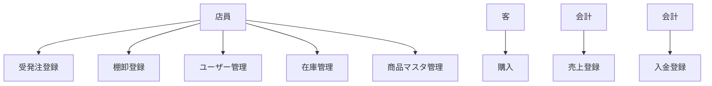
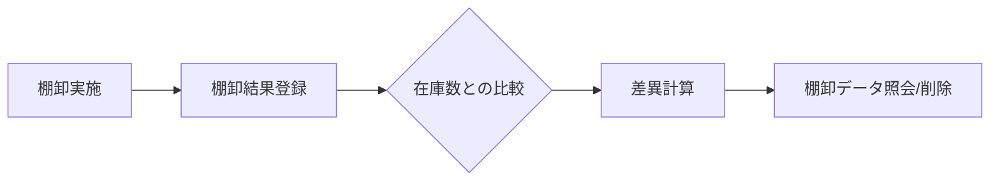
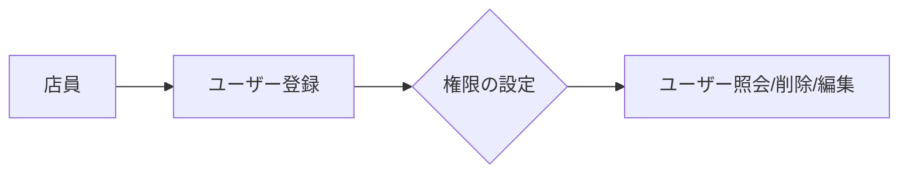
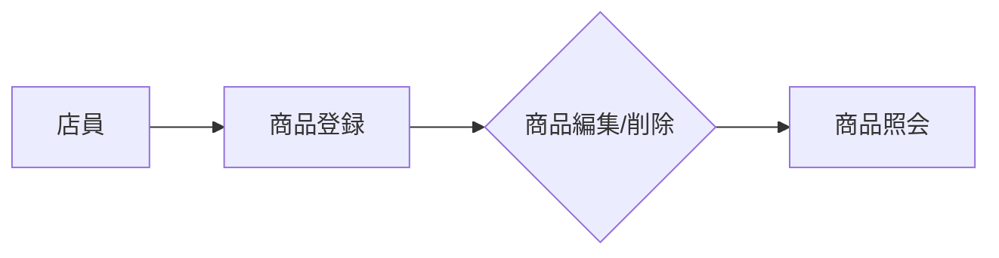
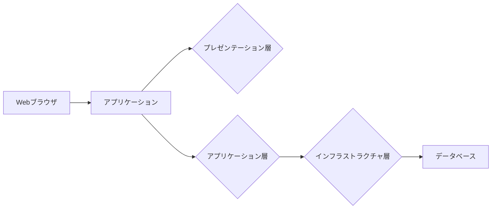

# 書店チェーンシステム要件定義

## 機能要件

1. **売上管理**
   - 売上データの登録、照会、削除
   - 売上データの集計（日別、週別、月別、年別）
   - 売上データのエクスポート（CSV, Excel）

2. **受発注管理**
   - 受発注データの登録、照会、削除
   - 在庫数との照合、不足分を自動計算
   - 発注書の作成

3. **棚卸管理**
   - 棚卸データの登録、照会、削除
   - 棚卸結果と在庫数の比較、差異を自動計算
   - 棚卸結果のエクスポート（CSV, Excel）

4. **入金管理**
   - 入金データの登録、照会、削除
   - 入金データと売上データの照合、未収金を自動計算
   - 入金書の作成

5. **ユーザー管理**
   - ユーザーの登録、削除、編集
   - 権限の設定と管理

6. **在庫管理**
   - 在庫数の照会と変更
   - 在庫数の自動計算（受発注管理、棚卸管理から）

7. **商品マスタ管理**
   - 商品マスタの登録、削除、編集

## ユースケース図

## 業務フロー図

### 売上業務フロー

### 受発注業務フロー

### 棚卸業務フロー

### 入金業務フロー

### ユーザー管理業務フロー

### 在庫管理業務フロー

### 商品マスタ管理業務フロー

## システム設計書

- **アーキテクチャ**: 3層アーキテクチャ（プレゼンテーション、アプリケーション、インフラストラクチャ）
- **技術スタック**:
  - フロントエンド: React
  - バックエンド: Node.js (Express)
  - データベース: PostgreSQL

## アーキテクチャ図

## データモデル

### テーブル一覧

| テーブル名 | 主キー | カラム名 |
| --- | --- | --- |
| 売上データ | id | 売上日時, 商品ID, 数量, 金額 |
| 受発注データ | id | 受発注日時, 商品ID, 数量, 状態 |
| 棚卸データ | id | 棚卸日時, 商品ID, 在庫数, 差異 |
| 入金データ | id | 入金日時, 売上データID, 金額, 状態 |
| ユーザー | id | ユーザー名, メールアドレス, パスワードハッシュ, 権限 |
| 商品マスタ | id | 商品名, 価格, 在庫数 |

## ユーザーインターフェース

- Webアプリケーション
- レスポンシブデザイン
- モバイル対応

## エラー処理

- 入力エラー: 入力内容に基づくエラーメッセージを表示
- システムエラー: エラーログを記録、ユーザーに友好的なメッセージを表示

## バックアップ

- データベースの定期バックアップ（毎日）
- バックアップファイルの保存先は別のサーバーまたはネットワークストレージ
- バックアップの自動化と復元手順の文書化

## セキュリティ

- ユーザー認証: ログイン機能、パスワードハッシュ化
- アクセス制御: 権限管理、ロールベースのアクセス制御
- データ暗号化: 暗号化通信（HTTPS）とデータベースレベルでの列レベル暗号化

## パフォーマンス

- キャッシュ機能の実装（Redis）
- データベースインデックスの最適化
- システムモニタリングとパフォーマンステストの実施

## ログ管理

- アプリケーションログの記録（winston）
- ログの集約と分析ツールの導入（ELKスタック）
- ログの定期的なアーカイブと削除

## テストケース

| テストケースID | 概要 | 手順 | 期待値 |
| --- | --- | --- | --- |
| TC001 | 売上データ登録テスト | 1. 売上データを登録する   2. 売上データ照会する | 売上データが正しく表示される |
| TC002 | 受発注データ登録テスト | 1. 受発注データを登録する   2. 受発注データ照会する | 受発注データが正しく表示される |
| TC003 | 棚卸データ登録テスト | 1. 棚卸データを登録する   2. 棚卸データ照会する | 棚卸データが正しく表示される |
| TC004 | 入金データ登録テスト | 1. 入金データを登録する   2. 入金データ照会する | 入金データが正しく表示される |
| TC005 | ユーザー登録テスト | 1. ユーザーを登録する   2. ユーザー照会する | ユーザーが正しく表示される |
| TC006 | 在庫数変更テスト | 1. 在庫数を変更する   2. 在庫数照会する | 在庫数が正しく表示される |
| TC007 | 商品登録テスト | 1. 商品を登録する   2. 商品照会する | 商品が正しく表示される |
| TC008 | エラー処理テスト | 1. 入力エラーを発生させる   2. システムエラーを発生させる | 適切なエラーメッセージが表示される |

## 非機能要件

- **可用性**: システムの99.5%のアップロード時間を確保
- **レスポンス時間**: ユーザー操作から画面反映まで3秒以内に完了
- **拡張性**: 新しい機能やデータの追加に対応可能な柔軟な設計
- **セキュリティ**: ユーザー認証とアクセス制御を実装し、データの暗号化を確保する
- **パフォーマンス**: キャッシュ機能の実装とデータベースインデックスの最適化により高いパフォーマンスを維持する
- **バックアップ**: データベースの定期的なバックアップと復元手順の文書化によりデータの損失を防止する

この要件定義は、書店チェーンシステムの機能要件、ユースケース図、業務フロー図、システム設計書、データモデル、ユーザーインターフェース、エラー処理、バックアップ、セキュリティ、パフォーマンス、ログ管理、テストケース非機能要件を網羅しています。この要件定義に基づき、システム開発が実施されます。