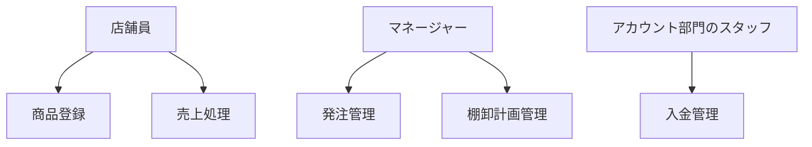

# 書店チェーンシステム要件定義
## 1. 目的
本要件定義は、書店チェーンの売上、受発注、棚卸、入金に関するシステム開発プロジェクトの基礎を提供します。このドキュメントは、プロジェクト全体の方向性と期待される機能を明確にし、関係者間のコミュニケーションを促進することを目的としています。

## 2. 利用者

- 書店チェーンのスタッフ
    - 店舗員
    - マネージャー
    - アカウント部門のスタッフ
- システム管理者

## 3. 機能要件

### 3.1 売上処理

#### 3.1.1 レジ機能

- 商品コードやバーコードを読み取り、商品情報を表示する
- 商品の数量と金額を入力し、小計と合計金額を表示する
- 支払方法（現金、クレジットカード、電子決済など）を選択し、支払い処理を行う
- 会計完了後、領収書の発行やメール送信をサポートする

#### 3.1.2 売上データ管理

- 売上データ（売上高、商品数量、販売日時など）を店舗ごとに集計し、保存する
- 集計データの検索やフィルター機能を提供する

### 3.2 受発注処理

#### 3.2.1 在庫管理

- 商品の在庫数量を実時で管理する
- 在庫切れや低在庫状態を自動検知し、発注を推奨する

#### 3.2.2 受発注処理

- 新規発注書の作成と送信
- 受領済み発注書の確認と在庫反映
- 発注履歴の参照と検索

### 3.3 棚卸処理

#### 3.3.1 棚卸計画管理

- 棚卸計画の作成、編集、削除
- 棚卸計画の自動割り当て（店舗別や日付別に）

#### 3.3.2 棚卸実施

- 棚卸対象商品の一覧表示と検索
- 商品の在庫数量と棚卸数量の比較、差異の確認
- 棚卸結果の保存と履歴参照

### 3.4 入金処理

#### 3.4.1 入金データ管理

- 入金データ（入金額、入金日時、支払方法など）を店舗ごとに集計し、保存する
- 集計データの検索やフィルター機能を提供する

#### 3.4.2 入金処理

- 新規入金データの作成と登録
- 入金履歴の参照と検索

## 4. ユースケース図



## 5. データベース設計

### 5.1 エンティティ関係図

```mermaid
erDiagram
    STORE {
        id PK
        name
    }

    PRODUCT {
        id PK
        code
        name
        price
        store_id FK
    }

    SALE {
        id PK
        product_id FK
        quantity
        sale_date
        store_id FK
    }

    ORDER {
        id PK
        product_id FK
        quantity
        order_date
        receive_date
        store_id FK
    }

    INVENTORY {
        id PK
        product_id FK
        stock_quantity
        last_check_date
        store_id FK
    }

    PAYMENT {
        id PK
        sale_id FK
        payment_method
        payment_amount
        payment_date
    }

    STORE ||--o{ PRODUCT : \"sells\"
    STORE ||--o{ SALE : \"makes\"
    STORE ||--o{ ORDER : \"places\"
    STORE ||--o{ INVENTORY : \"manages\"
    SALE ||--o{ PAYMENT : \"has\"
```

### 5.2 テーブル定義

| エンティティ | カラム名 | データ型 |制約 |
| --- | --- | --- | --- |
| STORE | id | INT | PRIMARY KEY, AUTO_INCREMENT |
|  | name | VARCHAR(100) | NOT NULL |
| PRODUCT | id | INT | PRIMARY KEY, AUTO_INCREMENT |
|  | code | CHAR(13) | UNIQUE, NOT NULL |
|  | name | VARCHAR(100) | NOT NULL |
|  | price | DECIMAL(10,2) | NOT NULL |
|  | store_id | INT | FOREIGN KEY (store_id) REFERENCES STORE(id), NOT NULL |
| SALE | id | INT | PRIMARY KEY, AUTO_INCREMENT |
|  | product_id | INT | FOREIGN KEY (product_id) REFERENCES PRODUCT(id), NOT NULL |
|  | quantity | INT | NOT NULL |
|  | sale_date | DATETIME | NOT NULL, DEFAULT CURRENT_TIMESTAMP |
|  | store_id | INT | FOREIGN KEY (store_id) REFERENCES STORE(id), NOT NULL |
| ORDER | id | INT | PRIMARY KEY, AUTO_INCREMENT |
|  | product_id | INT | FOREIGN KEY (product_id) REFERENCES PRODUCT(id), NOT NULL |
|  | quantity | INT | NOT NULL |
|  | order_date | DATETIME | NOT NULL |
|  | receive_date | DATETIME | NULLABLE |
|  | store_id | INT | FOREIGN KEY (store_id) REFERENCES STORE(id), NOT NULL |
| INVENTORY | id | INT | PRIMARY KEY, AUTO_INCREMENT |
|  | product_id | INT | FOREIGN KEY (product_id) REFERENCES PRODUCT(id), NOT NULL |
|  | stock_quantity | INT | NOT NULL |
|  | last_check_date | DATETIME | NULLABLE |
|  | store_id | INT | FOREIGN KEY (store_id) REFERENCES STORE(id), NOT NULL |
| PAYMENT | id | INT | PRIMARY KEY, AUTO_INCREMENT |
|  | sale_id | INT | FOREIGN KEY (sale_id) REFERENCES SALE(id), NOT NULL |
|  | payment_method | ENUM('CASH', 'CREDIT_CARD', 'DEBIT_CARD', 'ELECTRONIC') | NOT NULL |
|  | payment_amount | DECIMAL(10,2) | NOT NULL |
|  | payment_date | DATETIME | NOT NULL, DEFAULT CURRENT_TIMESTAMP |

## 6. 非機能要件

### 6.1 Performance Requirement

- 売上処理は、1回の会計処理につき3秒以内で完了すること
- 棚卸処理は、1回の棚卸作業につき5分以内で完了すること

### 6.2 Security Requirement

- システムへのアクセスは、ログイン認証を通じて制御されること
- ユーザーのパスワードは、暗号化され保存されること
- システム内で扱うデータは、適切なアクセス権限制御が実装されていること

### 6.3 Usability Requirement

- システムは、店舗員やマネージャーなどの一般的なユーザーにとって使いやすいこと
- システムの操作画面は、明確でわかりやすいデザインを採用すること

### 6.4 Reliability Requirement

- システムは、稼働中に障害が発生した場合でも、データの損失や不整合を防ぐための対策が実装されていること
- システムは、定期的なバックアップ処理を実施し、データの安全性を確保すること

## 7. 将来的な拡張性
\n本システムは、以下の機能や要件に対応するために設計されており、将来的な拡張性が確保されていること。

- 新規商品の登録と管理
- 複数店舗間の在庫移動処理
- 会員シ